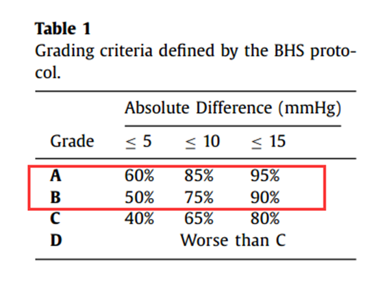
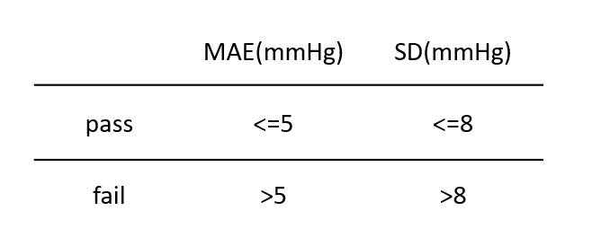

# 数据集2mat
> length = 1024

|         模型名称         | average_mse_loss | RMSE Loss | 归一化前总loss | MAE SBP |  MSE SBP  | SD_SBP  | MAE DBP | MSE DBP  | SD_DBP  | 
|:--------------------:|:----------------:|:---------:|:---------:|:-------:|:---------:|:-------:|:-------:|:--------:|:-------:|
|     cnn-lstm-ppg     |      0.0134      |  0.1155   | 281.4627  | 14.2112 | 437.2165  | 15.4965 | 11.9072 | 303.5553 | 12.4827 | 
|     patchtst-ppg     |      0.0042      |  0.0645   |  87.8265  | 7.6219  | 138.1481  | 8.8635  | 5.1728  | 77.4795  | 7.3165  |
|   patchtst-ppg+ecg   |      0.0048      |  0.0690   | 100.4596  | 8.7074  | 159.9748  | 9.1281  | 5.7956  | 81.5585  | 7.2161  | 
| crossformer-ppg+ecg  |      0.0038      |  0.0619   |  80.7775  | 7.0393  | 123.0274  | 8.6584  | 5.0378  | 67.1356  | 6.9595  | 
|    softs-ppg+ecg     |      0.0087      |  0.0935   | 184.4033  | 11.4373 | 287.6602  | 12.4303 | 8.0717  | 153.8381 | 9.6523  |
|  medformer-ppg+ecg   |      0.0032      |  0.0563   |  66.7901  | 6.1280  |  95.3150  | 7.5393  | 5.0020  | 64.8453  | 6.4997  |
|  medformer-ppg+ppg   |      0.0046      |  0.0679   | 97.3559   | 7.1812  | 134.3557  | 9.0748  | 5.9154  | 94.7465  | 7.9205  | 
|   medf_dec-ppg+ecg   |      0.0044      |  0.0660   |  91.8299  | 7.3256  | 137.3974  | 9.0064  | 5.7106  | 84.6292  | 7.4437  | 
| itransformer-ppg+ecg |      0.0381      |  0.1953   | 803.8553  | 34.7486 | 1820.0414 | 23.6844 | 23.1626 | 724.5032 | 13.9485 |
|  timemixer-ppg+ecg   |      0.0086      |   0.0929  |  181.9439 | 12.1272 | 281.1597  | 11.8479 | 9.0559  | 160.2216 | 9.3849  | 
|  bpformer-ppg+ecg    |      0.0041      |  0.0642   |  87.0462  |  7.3303 | 126.6045  | 8.6217  | 5.9230  | 82.6581  | 7.2454  | 
|  msgnet-ppg+ecg      |     0.0079       |  0.0888   |  166.3099 | 11.2094 | 255.4992  | 11.3036 | 8.2832  | 144.4841 | 8.8842  |
|                      |                  |           |           |         |           |         |         |          |         |

|         模型名称         |   SBP5    |   SBP10   |   SBP15   |   DBP5    |   DBP10   |   DBP15   |
|:--------------------:|:---------:|:---------:|:---------:|:---------:|:---------:|:---------:|
|     cnn-lstm-ppg     | 31.3120%  | 53.1457%  | 66.9534%  | 35.7605%  | 58.5621%  | 71.9409%  |
|     patchtst-ppg     | 50.8755%  | 76.6832%  | 87.5988%  | 66.0458%  | 87.4029%  | 93.6918%  |
|   patchtst-ppg+ecg   | 43.1019%  | 71.0369%  | 84.8365%  | 58.3990%  | 84.3652%  | 92.5187%  |
| crossformer-ppg+ecg  | 53.5731%  | 78.0768%  | 87.9761%  | 65.9951%  | 85.8339%  | 92.0496%  |
|    softs-ppg+ecg     | 39.3100%  | 62.0124%  | 74.9886%  | 48.3626%  | 73.0579%  | 84.8845%  |
|  medformer-ppg+ecg   | 60.1533%  | 83.4659%  | 91.5994%  | 66.7803%  | 87.4745%  | 93.8422%  |
|  medformer-ppg+ppg   | 55.1557%  | 79.2201%  | 88.6656%  | 60.9970%  | 83.7954%  | 91.8172%  |
|   medf_dec-ppg+ecg   | 54.7382%  | 78.7711%  | 88.4774%  | 61.8139%  | 84.6041%  | 92.2181%  |
| itransformer-ppg+ecg |  8.3409%  | 17.8118%  | 27.3166%  |  8.9763%  | 18.7078%  | 29.4122%  |
|  timemixer-ppg+ecg   | 32.2385%  | 55.6205%  | 70.8680%  |  39.5132% |  66.0864% | 81.2493%  |
|   bpformer-ppg+ecg   | 54.0965%  | 79.1464%  | 88.9411%  |  60.9133% | 84.5202%  | 92.4475%  |
|   msgnet-ppg+ecg     | 36.7638%  | 60.4308%  | 74.5848%  | 44.7250%  |  70.7934% | 83.9277%  |
|                      |           |           |           |           |           |           |

# 数据集1csv

|    模型     | average_loss | RMSE Loss |   归一化前   |
|:---------:|:------------:|:---------:|:--------:|
| patchtst  |   0.0042     |  0.0651   | 88.2288  |
| cnn-lstm  |    0.0082    |  0.0906   | 170.6542 |
